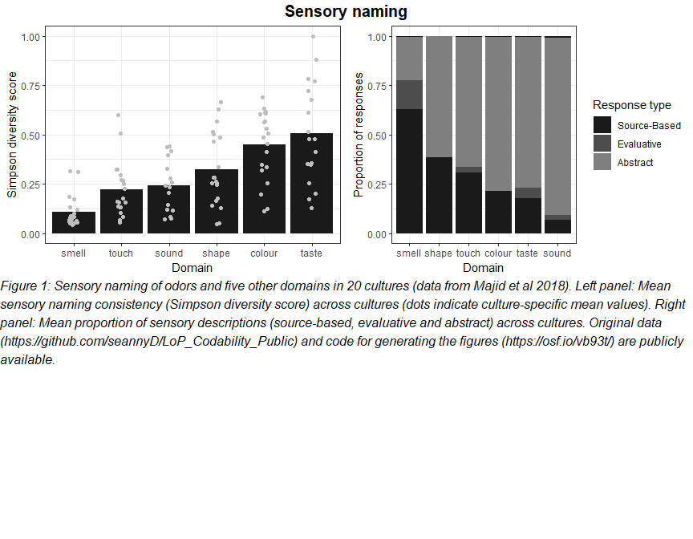

Majid Commentary
================
Stephen Pierzchajlo

Below are code that will reproduce the graph in our commentary. The code
is displayed mostly without comment, and it is assumed the user wishing
to reproduce the graph has the relevant .csv files which are freely
available here: <https://github.com/seannyD/LoP_Codability_Public>.

``` r
# Load libraries
library(plyr)
library(ggplot2)
library(reshape2)
library(ggpubr)

# Load "AllData_Lop.csv" file.
d = read.csv("C:\\Users\\STPI0560\\Desktop\\Majid Analysis\\Majid_files\\LoP_Codability_Public-master\\data\\AllData_LoP.csv", stringsAsFactors = F)

# This code is identical to that made available.
d = d[!is.na(d$head),]
d = d[!d$head %in% c("n/a","no description"),]
d = d[!is.na(d$SAE),]
d.all = d

d = d[d$Response==1,]
d$SAE = as.factor(d$SAE)
# Make colour baseline
sae.order = c("colour","shape","sound","touch","taste","smell")
d$domain = factor(d$domain, levels = sae.order)
tx = table(d$SAE,d$domain)
tx2 =melt(prop.table(tx,margin = 2))
tx2$Var1 = factor(tx2$Var1, levels = c("S","E","A"))

tx22 <- tx2[-c(3, 7, 11, 15, 19,23), ]

tx22$Var3 <- ifelse(tx22$Var1 == "E", "Evaluative",
                    ifelse(tx22$Var1 == "A", "Abstract",
                    ifelse(tx22$Var1 == "S", "Source-Based",
                    "FF")))

# Read in Bar Graph Dataframe.
Majid <- read.csv("C:\\Users\\STPI0560\\Desktop\\Experiments\\Majid Simulation\\Data\\DiversityIndices_ND.csv", stringsAsFactors = F)

# Rename columns.
colnames(Majid) <- c("Language","domain","Stimulus.code","simpson.diversityIndex","shannon.diversityIndex","Number","BnL.diversityIndex","mean.number.of.words")

MajidLanguage <- ddply(Majid, c("domain", "Language"), summarise,
               N    = length(simpson.diversityIndex) + sum(Number - 1),
               DiversityScore = mean(simpson.diversityIndex))

MajidBar_Diversity <- ddply(Majid, c("domain"), summarise,
               N    = length(simpson.diversityIndex) + sum(Number - 1),
               DiversityScore = mean(simpson.diversityIndex))

MajidBar_Diversity$domain <- factor(MajidBar_Diversity$domain, levels = MajidBar_Diversity$domain[order(MajidBar_Diversity$DiversityScore)])

A <- ggplot(tx22, aes(x = factor(Var2, levels = c("smell", "shape", "touch", "colour", "taste", "sound")), y = value,fill = factor(Var3, levels = c("Source-Based", "Evaluative", "Abstract"))), na.rm = TRUE) +
geom_bar(position = "fill",stat = "identity", na.rm = TRUE) +
xlab("Domain") + ylab("Proportion Of Responses") +
scale_fill_discrete(name = "Description type",
breaks = c("Evaluative", "Abstract", "Source-Based"),
labels=c("Evaluative","Abstract","Source-Based"))+
#  ggtitle("Sensory naming") +
  theme_bw() +
  guides(fill=guide_legend(title="Response type")) +
  theme(plot.title = element_text(hjust = 0.5)) +
  ylab("Proportion of responses") +
  scale_fill_manual(values=c("grey10","grey30","grey50")) +
geom_col(position = position_stack(reverse = TRUE))
  
B <- ggplot(MajidBar_Diversity, aes(x = domain, y = DiversityScore, fill = domain)) +
geom_bar(stat = "identity") +
xlab("Domain") + ylab("Simpson diversity score") +
#  ggtitle("Sensory naming") +
  theme_bw() +
  theme(plot.title = element_text(hjust = 0.5)) +
  scale_fill_manual(values = c("grey10","grey10","grey10","grey10","grey10","grey10")) +
  geom_jitter(data = MajidLanguage, width = 0.1, color = "grey") +
  theme(legend.position = "none")

text <- paste("Figure 1: Sensory naming of odors and five other domains in 20 cultures (data from Majid et al 2018). Left panel: Mean sensory naming consistency", "(Simpson diversity score) across cultures (dots indicate culture-specific mean values). Right panel: Mean proportion of sensory descriptions (source-based, evaluative and abstract) across cultures. Original data (https://github.com/seannyD/LoP_Codability_Public) and code for generating the figures (https://osf.io/vb93t/) are publicly available.")

text.p <- ggparagraph(text = text, face = "italic", size = 12, color = "black") +
            theme(plot.margin = unit(c(t = 0, r = 0, b = 0, l = 0),"lines"))

figure <- ggarrange(B, A,
          ncol = 2, nrow = 1) 
figure2 <- text.p

figure3 <- ggarrange(figure, figure2, ncol=1, nrow=2, vjust = c(0, 20))
annotate_figure(figure3, top = text_grob("Sensory naming", color = "black", face = "bold", size = 15))
```

<!-- -->
